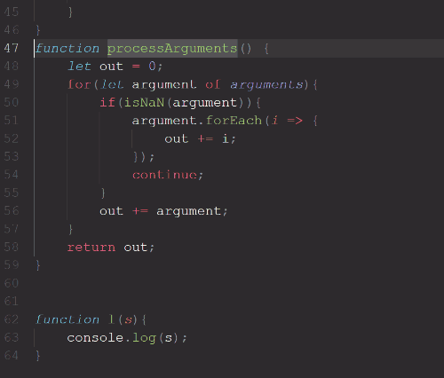
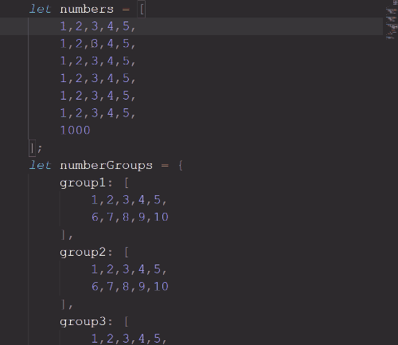
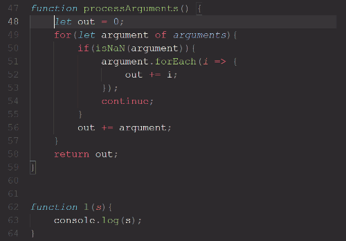
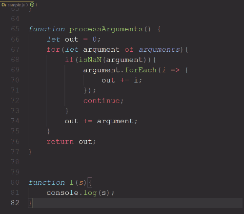

# Smart PageUp/PageDown

Modifies the functionality of `PageUp` and `PageDown` buttons to move and select with the pointer depending on the context of surrounding code. Has options to navigate based on different types of brackets.

## Features

Using the `PageDown` or `PageUp` keys will move the cursor based on the contents of the current block of code.  

* #### `Shift + PageUp`/`Shift + PageDown` will select text.  

* #### When inside a block, the contents of the block will be selected. If there are blocks of code contained inside, they will be selected in order.   

* #### The cursor escapes a block of code when `PageUp`/`PageDown` is pressed again.  

* #### The cursor will jump between blocks at its current depth.  

## Extension Settings

* `Page Up/Down.maxPageSize`: Sets the maximum number of lines the extension will be able to jump.
* `Page Up/Down.useCurlyBrackets`: Enable to consider curly brackets when using hotkeys.
* `Page Up/Down.useSquareBrackets`: Enable to consider square brackets when using hotkeys.
* `Page Up/Down.useParentheses`: Enable to consider parentheses when using hotkeys.

## Release Notes

### 1.0.0

Initial release of extension.
